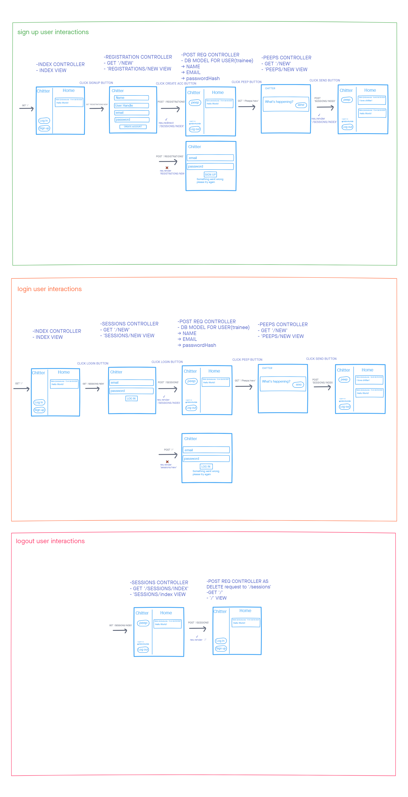
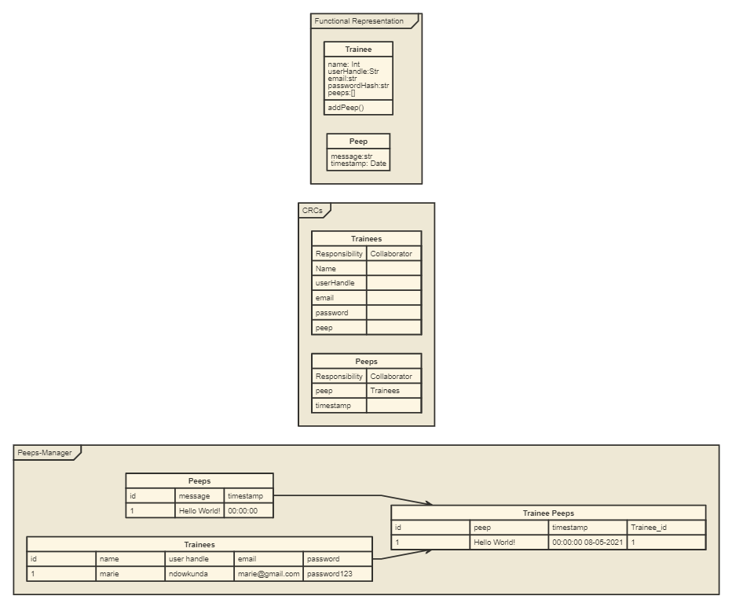

# Chitter Challenge

<!-- ABOUT THE PROJECT -->
## About The Project

A website where trainees can login or sign up to send messages (peeps).  Demostrating understanding of software development II objectives; how the web works and the MVC pattern.

## Built With

* [Bootstrap](https://getbootstrap.com)
* [Cypress](https://www.cypress.io/)
* [ejs](https://ejs.co/#install)
* [Express](http://expressjs.com/)
* [Sequelize](https://sequelize.org/master/index.html)

<!-- GETTING STARTED -->
## Getting Started

These instructions will get you a copy of the project up and running on your local machine for development and testing purposes.

### Prerequisites

To clone and run this application, you'll need;

* [Git](https://git-scm.com)

* [Node.js](https://nodejs.org/en/download/) (which comes with [npm](http://npmjs.com)) installed on your computer.

### Installation

From your command line:

```bash
# Clone this repository
git clone https://github.com/ndowkunda/chitter-challenge.git

# Go into the repository
cd chitter-challenge

# Install dependencies
npm install

#create peeps-manager database

## create and migrate development database
 npx sequelize-cli db:create
 npx sequelize-cli db:migrate

# create and migrate test database
 NODE_ENV=test npx sequelize-cli db:create
 NODE_ENV=test npx sequelize-cli db:migrate

# run your tests using your test db
 NODE_ENV=test npx nodemon app.js
 NODE_ENV=test npx cypress open
```

## Problem Approach

1. Mockups for user interactions


2. process model for user interactions
   <!--  -->

3. Domain models for business logic


## Tests

This project used cypress for its feature tests and jasmine for its unit tests

## Usage

### User Interactions


